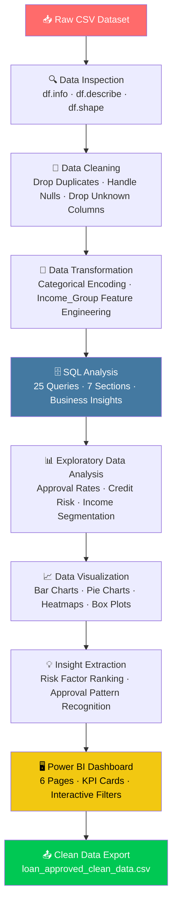

<div align="center">

<!-- Animated Header Banner -->


<br/>

<!-- Animated Subtitle Title -->


<!-- Typing Animation -->
<a href="https://git.io/typing-svg">
  
</a>

<br/>

<!-- Core Badges -->
[](https://python.org)
[](https://pandas.pydata.org)
[](https://numpy.org)
[](https://seaborn.pydata.org)
[](https://matplotlib.org)
[](https://mysql.com)
[](https://powerbi.microsoft.com)
[](https://jupyter.org)
[](https://github.com)

<br/>

<!-- Status Badges -->


</div>

---

## 📖 Table of Contents

<details>
<summary><b>Click to Expand Navigation Menu</b></summary>

- [🧩 Problem Statement](#-problem-statement)
- [🎯 Project Objectives](#-project-objectives)
- [💡 Value Proposition](#-value-proposition)
- [📊 Dataset Overview](#-dataset-overview)
- [🛠️ Tech Stack](#️-tech-stack)
- [⚙️ Project Workflow](#️-project-workflow)
- [📈 Key Findings & Insights](#-key-findings--insights)
- [🗄️ SQL Analysis](#️-sql-analysis)
- [📊 Visualizations Produced](#-visualizations-produced)
- [🖥️ Power BI Dashboard](#️-power-bi-dashboard)
- [📁 Project Structure](#-project-structure)
- [🚀 Getting Started](#-getting-started)
- [🌟 Future Roadmap](#-future-roadmap)
- [👨‍💻 Author](#-author)

</details>

---

## 🧩 Problem Statement

<div align="center">
<table>
<tr>
<td align="center" width="33%">

### 😰 Pain Point
Financial institutions struggle to **efficiently evaluate loan applications** and predict default risk. Manual review processes are slow, inconsistent, and prone to human bias — leading to poor lending decisions.

</td>
<td align="center" width="33%">

### 🔍 The Gap
Vast amounts of **applicant financial and demographic data** go underutilized. There is no systematic way to connect income levels, credit history, property location, and employment status to concrete approval outcomes.

</td>
<td align="center" width="33%">

### 💊 The Cost
Poor loan approval decisions result in **higher default rates, revenue loss**, and regulatory risk — all of which could be mitigated with data-driven, credit risk-aware lending frameworks.

</td>
</tr>
</table>
</div>

---

## 🎯 Project Objectives

```
╔══════════════════════════════════════════════════════════════════╗
║                    🎯  PROJECT TARGETS                           ║
╠══════════════════════════════════════════════════════════════════╣
║  ✅  Analyze 563+ loan applications end-to-end                   ║
║  ✅  Identify top approval factors (credit history, income)      ║
║  ✅  Quantify how demographics correlate with loan outcomes      ║
║  ✅  Segment applicants by income group for targeted insights    ║
║  ✅  Build 25 SQL queries across 7 analytical sections           ║
║  ✅  Build interactive 6-page Power BI dashboard                 ║
║  ✅  Generate clean, exportable dataset for further use          ║
╚══════════════════════════════════════════════════════════════════╝
```

---

## 💡 Value Proposition

<div align="center">

| 👥 Who Benefits | 🎁 What They Get | 📌 Why It Matters |
|:---|:---|:---|
| **Loan Officers & Analysts** | Visual risk profiles per applicant segment | Faster, evidence-based lending decisions |
| **Risk Management Teams** | Credit history & approval rate dashboards | Reduced default exposure |
| **Branch Managers** | Property area performance breakdowns | Optimized regional lending strategy |
| **Data Scientists** | Clean, structured dataset + EDA + SQL | Foundation for ML credit scoring models |
| **Business Stakeholders** | KPI-driven Power BI report with filters | Real-time portfolio visibility |

</div>

---

## 📊 Dataset Overview

<div align="center">

```
┌─────────────────────────────────────────────────────────────────┐
│                     📋  DATASET SNAPSHOT                        │
├─────────────────────────────────────────────────────────────────┤
│   📦  Source        :  Loan Approval CSV Dataset                │
│   👥  Records       :  563 loan applications                   │
│   🔢  Features      :  13 variables                            │
│   🎯  Target Label  :  Loan_Status (Y = Approved, N = Rejected)│
└─────────────────────────────────────────────────────────────────┘
```

</div>

### 🔑 Feature Breakdown

| Category | Features | Type |
|:---|:---|:---|
| 🧍 **Demographics** | Gender, Married, Dependents | Categorical |
| 🎓 **Education** | Education (Graduate / Not Graduate) | Categorical → Encoded |
| 💼 **Employment** | Self_Employed | Categorical → Encoded |
| 💰 **Financial** | ApplicantIncome, CoapplicantIncome, LoanAmount | Numerical (Continuous) |
| 📅 **Loan Details** | Loan_Amount_Term, Credit_History | Numerical |
| 🏘️ **Location** | Property_Area (Urban / Semiurban / Rural) | Categorical |
| 🎯 **Target** | Loan_Status (Y / N) | Binary |
| 📊 **Engineered** | Total_Income, Income_Group (Low/Medium/High) | Derived |

---

## 🛠️ Tech Stack

<div align="center">

| Layer | Tool | Purpose |
|:---:|:---:|:---|
|  | **Python 3.10+** | Core analysis language |
|  | **Pandas** | Data loading, cleaning, transformation |
|  | **NumPy** | Numerical computations & statistics |
|  | **Matplotlib** | Base plotting layer |
|  | **Seaborn** | Statistical visualizations |
|  | **MySQL** | 25 structured SQL queries across 7 sections |
|  | **Jupyter Notebook** | Interactive development environment |
|  | **Power BI Desktop** | 6-page business intelligence dashboard |
|  | **Git & GitHub** | Version control & collaboration |

</div>

---

## ⚙️ Project Workflow



### Step-by-Step Breakdown

<details>
<summary>📥 <b>Step 1 — Data Loading</b></summary>

```python
import numpy as np
import pandas as pd
import matplotlib.pyplot as plt
import seaborn as sns

df = pd.read_csv("loan_approved.csv")
```
</details>

<details>
<summary>🔍 <b>Step 2 — Data Inspection</b></summary>

```python
df.head()        # First 5 rows
df.tail()        # Last 5 rows
df.info()        # Column types & non-null counts
df.describe()    # Summary statistics
df.shape         # (rows, columns)
df.columns       # All feature names
```
</details>

<details>
<summary>🧹 <b>Step 3 — Data Cleaning</b></summary>

```python
df.isnull().sum()                      # Check missing values per column
df.isnull().sum().sum()                # Total null count
df.drop_duplicates(inplace=True)       # Remove duplicate records
df.drop(columns=['myunknowncolumn'])   # Drop irrelevant columns
```
> ✅ Dataset cleaned — unknown columns removed, duplicates dropped.
</details>

<details>
<summary>🔄 <b>Step 4 — Data Transformation</b></summary>

```python
# Encode categorical variables to numeric
df['Gender']        = df['Gender'].map({'Male': 1, 'Female': 0})
df['Married']       = df['Married'].map({'Yes': 1, 'No': 0})
df['Self_Employed'] = df['Self_Employed'].map({'Yes': 1, 'No': 0})
df['Education']     = df['Education'].map({'Graduate': 1, 'Not Graduate': 0})

# Engineer Total Income & Income Groups
df['Total_Income'] = df['ApplicantIncome'] + df['CoapplicantIncome']

df['Income_Group'] = pd.cut(df['Total_Income'],
                             bins=[0, 3000, 7000, float('inf')],
                             labels=['Low Income', 'Medium Income', 'High Income'])
```
</details>

<details>
<summary>📊 <b>Step 5 — EDA & Visualization</b></summary>

```python
# Approval Distribution
print(df['Loan_Status'].value_counts())

# Credit History vs Approval
sns.countplot(x='Credit_History', hue='Loan_Status', data=df)

# Income Distribution
sns.histplot(df['ApplicantIncome'], bins=20)

# Loan Amount by Property Area
sns.boxplot(x='Property_Area', y='LoanAmount', data=df)

# Approval Rate by Gender
sns.countplot(x='Gender', hue='Loan_Status', data=df)

# Correlation Heatmap
sns.heatmap(df.corr(), annot=True, cmap='coolwarm')
```
</details>

---

## 📈 Key Findings & Insights

<div align="center">

> ### 🔬 What the Data Revealed

</div>

```
💳  GOOD CREDIT HISTORY ──────────►  ↑ 79.18% Approval Rate (vs 6.41% without)
🏘️  SEMIURBAN AREA ───────────────►  ↑ Highest Approval Rate (78.40%)
👨‍🎓  GRADUATE EDUCATION ────────────►  ↑ Slightly Higher Approval (138.70 vs 133.68)
💍  MARRIED APPLICANTS ───────────►  ↑ Higher Volume & Approval Count
💰  MEDIUM INCOME GROUP ──────────►  ↑ Largest Applicant Pool (364 applicants)
🏢  SELF-EMPLOYED ────────────────►  ↓ Marginally Lower Approval (65.33% vs 69.67%)
```

| # | Insight | Actionable Implication |
|:--|:---|:---|
| 1 | 💳 **Credit history is the #1 approval driver** | Prioritize credit building programs for applicants |
| 2 | 🏘️ **Semiurban applicants have highest approval rate (78.4%)** | Target semiurban markets for loan product expansion |
| 3 | 👨‍🎓 **Graduates get marginally better approvals** | Education level as a secondary scoring factor |
| 4 | 💍 **63.4% of applicants are married** | Develop joint-income loan products for married couples |
| 5 | 💰 **Medium income group dominates (64.7% of applicants)** | Design competitive mid-tier loan products |
| 6 | 🏢 **Self-employed applicants face slightly lower approvals** | Create tailored documentation pathways for self-employed |

---

## 🗄️ SQL Analysis

The project includes **25 structured SQL queries** organized into **7 analytical sections** using MySQL.

```sql
-- Database Setup
CREATE DATABASE finance;
USE finance;
RENAME TABLE loan_approved_clean_data TO loan;
```

| Section | Focus Area | Queries |
|:---|:---|:---:|
| 📋 **Section 1** | Basic Queries — View, Count, Filter | Q1 – Q5 |
| 📊 **Section 2** | Aggregation & Grouping — Averages, Rates | Q6 – Q10 |
| 🔍 **Section 3** | Filtering & Conditions — Multi-criteria | Q11 – Q13 |
| 🔄 **Section 4** | Derived Columns & CASE WHEN — Income Groups | Q14 – Q16 |
| 🔗 **Section 5** | Subqueries & Nested Analysis | Q17 – Q19 |
| 🪟 **Section 6** | Window Functions — RANK, PARTITION BY | Q20 – Q22 |
| 💡 **Section 7** | Business Insights — Combined Analysis | Q23 – Q25 |

<details>
<summary>🔎 <b>Sample SQL Queries</b></summary>

```sql
-- Approval Rate by Gender
SELECT gender,
    COUNT(*) AS total_applicants,
    SUM(CASE WHEN loan_status = 'Y' THEN 1 ELSE 0 END) AS approvals,
    ROUND(SUM(CASE WHEN loan_status = 'Y' THEN 1 ELSE 0 END)/COUNT(*)*100, 2) AS approval_rate
FROM loan
GROUP BY gender;

-- Rank Applicants by Total Income
SELECT Loan_ID,
    ApplicantIncome + CoapplicantIncome AS total_income,
    RANK() OVER (ORDER BY (ApplicantIncome + CoapplicantIncome) DESC) AS rank_number
FROM loan;

-- Best Credit History + Education Combination
SELECT Credit_History, Education,
    COUNT(*) AS total_applicants,
    ROUND(SUM(CASE WHEN Loan_Status = 'Y' THEN 1 ELSE 0 END)/COUNT(*)*100, 2) AS approval_rate
FROM loan
GROUP BY Credit_History, Education
ORDER BY approval_rate DESC;
```
</details>

---

## 📊 Visualizations Produced

| Plot Type | Variable(s) | Purpose |
|:---|:---|:---|
| 📊 **Histogram** | ApplicantIncome | Applicant income distribution |
| 📦 **Box Plot** | LoanAmount vs Property_Area | Loan amount spread by location |
| 📊 **Count Plot** | Credit_History vs Loan_Status | Credit history impact on approval |
| 📊 **Count Plot** | Gender vs Loan_Status | Gender-based approval patterns |
| 📊 **Count Plot** | Self_Employed vs Loan_Status | Employment type influence |
| 🌡️ **Heatmap** | All features | Full feature correlation matrix |
| 🍩 **Donut Chart** | Approved vs Rejected | Overall approval split |
| 📉 **Bar Chart** | Property_Area vs Approval Rate | Location-based approval performance |

---

## 🖥️ Power BI Dashboard

<div align="center">

> **`dashboard/loan.pbix`**

</div>

The Power BI dashboard provides a comprehensive 6-page interactive report with filters and KPI cards across all dimensions of loan approval analysis.

### 📋 Dashboard Pages — Screenshots

---

#### 🏠 Page 1 — Overview Dashboard
> Total KPIs, approval rate, income group breakdown, property area performance


---

#### 👥 Page 2 — Applicant Demographics
> Gender, education, marital status, self-employment analysis


---

#### 💰 Page 3 — Financial Insights
> Income vs loan amount, income group summary, co-applicant income breakdown


---

#### 🏘️ Page 4 — Property & Location
> Applications and approval rates by property area (Semiurban / Urban / Rural)


---

#### 💳 Page 5 — Credit Risk Analysis
> Credit history distribution, approval rate by credit score, marital status impact


---

#### 💡 Page 6 — Advanced Insights
> Target customer segments, approval trends, multi-dimensional matrix comparisons


---

### 📊 Live KPIs (Overview Page)

| KPI | Value | Insight |
|:---|:---:|:---|
| 📋 **Total Applications** | **563** | Full dataset cohort |
| ✅ **Total Approved** | **389** | Strong overall approval volume |
| ❌ **Total Rejected** | **174** | 30.9% rejection rate |
| 📈 **Approval Rate %** | **69.09%** | Nearly 7 in 10 applicants approved |
| 💰 **Avg Total Income** | **5.48K** | Middle-income dominant portfolio |
| 🏦 **Avg Loan Amount** | **141.89** | Moderate ticket-size lending |

### 🎛️ Interactive Filters

| Filter | Options |
|:---|:---|
| 👤 Gender | Male / Female |
| 🎓 Education | Graduate / Not Graduate |
| 💍 Married | Yes / No |
| 💼 Self_Employed | Yes / No |
| 🏘️ Property_Area | Semiurban / Urban / Rural |
| 💰 Income_Group | Low / Medium / High |
| 📊 Loan_Status | Y / N |

### 📈 Chart-by-Chart Analysis

| Dashboard Page | Chart | Key Finding |
|:---|:---|:---|
| **Overview** | Approval % by Property Area | Semiurban leads at 78.4%; Rural lowest at 60.25% |
| **Overview** | Avg Loan by Income Group | Medium income group carries highest total loan volume (10.36K) |
| **Demographics** | Self Employment Analysis | Non-self-employed approval: 69.67% vs self-employed: 65.33% |
| **Demographics** | Education Distribution | 78.86% of applicants are graduates |
| **Financial** | Income Group Summary | Medium income (364 apps) dwarfs High (155) and Low (44) |
| **Credit Risk** | Approved vs Rejected by Credit History | Good credit = 79.18% approval; Poor credit = only 6.41% |
| **Advanced** | Gender × Education × Property Matrix | Non-graduate urban females show 100% approval rate (small sample) |

---

## 📁 Project Structure

```
Loan-Approval-Risk-Analysis/
│
├── 📂 data/
│   ├── loan_approved.csv                  ← Raw input dataset
│   └── loan_approved_clean_data.csv       ← Cleaned output dataset
│
├── 📂 notebooks/
│   └── Loan_approved.ipynb                ← Full EDA & Python notebook
│
├── 📂 sql/
│   └── loan_approved.sql                  ← 25 SQL queries (7 sections)
│
├── 📂 dashboard/
│   ├── loan.pbix                          ← Power BI file (6 pages)
│   └── loan_dashboards.pdf                ← Exported dashboard screenshots
│
└── README.md                              ← You are here 👈
```

---

## 🚀 Getting Started

### Prerequisites


### Step 1 — Clone the Repository

```bash
git clone https://github.com/your-username/Loan-Approval-Risk-Analysis.git
cd Loan-Approval-Risk-Analysis
```

### Step 2 — Install Python Dependencies

```bash
pip install pandas numpy matplotlib seaborn jupyter
```

### Step 3 — Launch the Notebook

```bash
jupyter notebook notebooks/Loan_approved.ipynb
```

### Step 4 — Run SQL Queries

```bash
# Connect to MySQL and run:
mysql -u root -p
source sql/loan_approved.sql
```

### Step 5 — Open Power BI Dashboard

```
1. Install Power BI Desktop (free from Microsoft)
2. Open dashboard/loan.pbix
3. Refresh data source pointing to data/loan_approved_clean_data.csv
4. Explore all 6 pages with interactive filters!
```

---

## 🌟 Future Roadmap

```
Version 1.0  ✅  EDA + SQL Analysis + Power BI Dashboard (6 Pages)
     │
     ▼
Version 1.5  🔄  Advanced SQL — Stored Procedures & Views
     │
     ▼
Version 2.0  📌  Machine Learning Models (Logistic Regression, XGBoost)
     │
     ▼
Version 2.5  📌  Streamlit Web App for Live Loan Predictions
     │
     ▼
Version 3.0  📌  Real-Time Applicant Scoring via API + Cloud Deployment
```

| Milestone | Feature | Status |
|:---|:---|:---:|
| 🔬 Core EDA | Python Analysis Notebook | ✅ Done |
| 🗄️ SQL Analysis | 25 Queries across 7 Sections | ✅ Done |
| 📊 Dashboard | Power BI 6-Page Interactive Report | ✅ Done |
| 🗃️ Advanced SQL | Stored Procedures & Views | 🔄 Planned |
| 🤖 ML Models | Credit Risk Predictive Modeling | 📌 Upcoming |
| 🌐 Web App | Streamlit Loan Approval Tool | 📌 Upcoming |
| ☁️ Cloud | Azure / AWS Real-Time Scoring | 📌 Future |

---

## 👨‍💻 Author

<div align="center">

### **Md Matloob Alam**

[](https://github.com/alam292)
[](https://www.linkedin.com/in/md-matloob-a-016408229/)
[](mailto:your@email.com)

*Data Analyst passionate about transforming financial data into actionable lending insights.*

</div>

---

<div align="center">

### ⭐ Found this project useful?

**Give it a star on GitHub and share it with your network!**

[](https://github.com/alam292/Loan-Approval-Risk-Analysis)
[](https://github.com/alam292/Loan-Approval-Risk-Analysis/fork)

<br/>


</div>
